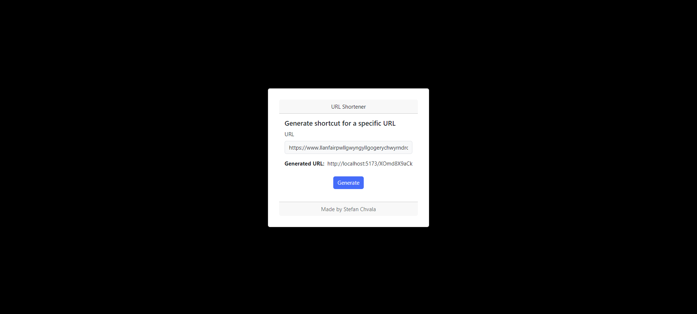

# url_shortener_tool
Represents a simple tool for shortening URLs.  
Everyone has sometimes encountered the problem of having to type in long URLs.  
This tool generates a shortened version of the URL.  
You can create a file where you store all the shortened URLs.  
The underlying database is a Redis key-value store.  

## Used technologies
  
 
   

 
Following technology stack was used:
* **Frontend**: React
* **Backend**: Node.js (with Express)
* **Database**: Redis (official Docker image: https://hub.docker.com/_/redis)

## Guide
* Start your Redis instance (either standalone or using Docker)
* Start the [backend](./url_shortener/Backend) application (configure all necessary information [here](./url_shortener/Backend/config))
* Start the [frontend](./url_shortener/Frontend) application (configure all necessary information [here](./url_shortener/Frontend/url_shortener_frontend/src/config))
* Generate a shortened URL and paste in a new window
